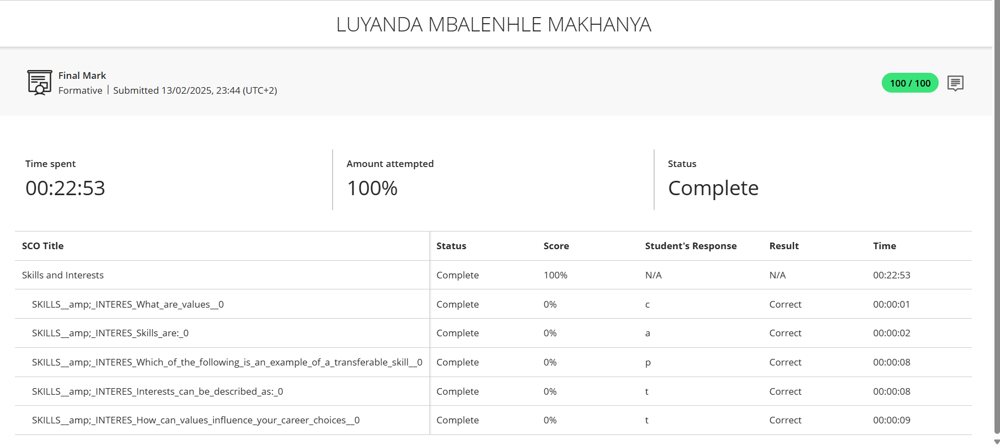
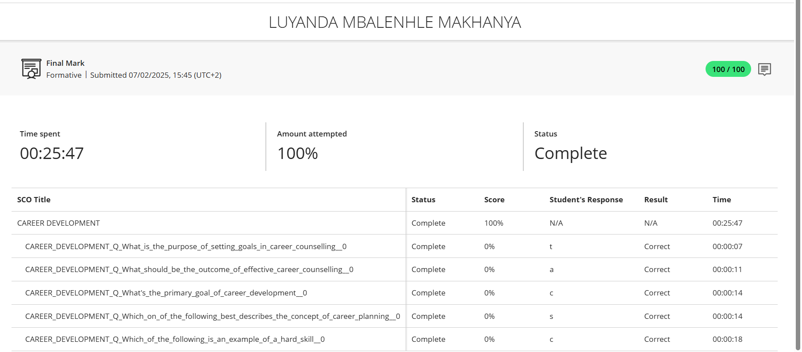

# 💼 Luyanda's Professional Digital Portfolio

## 👤 About Me  
Hello! My name is **Luyanda**, a **Diploma in ICT: Application Development** student at CPUT.  
This portfolio showcases my skills, experiences, and reflections based on work readiness training.

---

## 🎯 Career Counselling

### 🪞 Reflection: Career Counselling (STAR Technique)

**S – Situation**  
As part of my work readiness training, I was required to complete a Career Development quiz that assessed my understanding of topics such as goal setting, career planning, and identifying hard and soft skills.

**T – Task**  
My objective was to test my knowledge and application of the career counselling material and demonstrate my readiness to make informed career decisions.

**A – Action**  
I completed the quiz independently and carefully considered each question, applying concepts I had learned through the career counselling process.

**R – Result**  
I achieved a **100/100 score**, which reflects my strong grasp of the subject matter and my active engagement with the career development process.

## 🧠Skills and Interests

### 🪞 Reflection: Skills & Interests (STAR Technique)

**S – Situation**  
As part of my personal development training, I completed a quiz focused on understanding my core skills, interests, and values that influence career choices.

**T – Task**  
The goal was to assess how well I could identify transferable skills, differentiate between interests and values, and understand their impact on career paths.

**A – Action**  
I reviewed my study materials, reflected on my past experiences, and answered each question thoughtfully. I drew from both academic knowledge and personal self-awareness.

**R – Result**  
I achieved a **100/100 score**, successfully identifying key concepts and their relevance to career development. This reflection helped me recognize my strengths and how they align with roles in technology and development.

## Create CV

