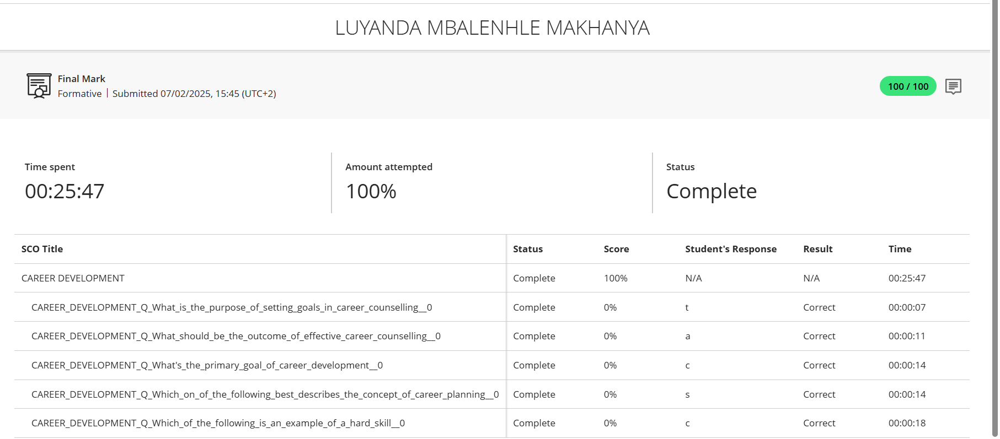
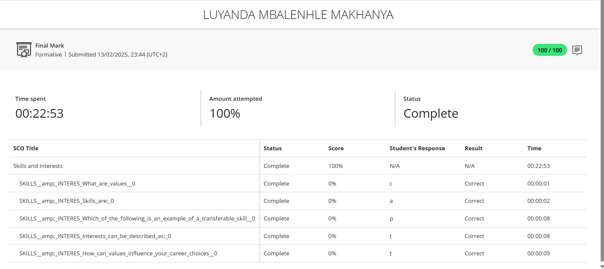
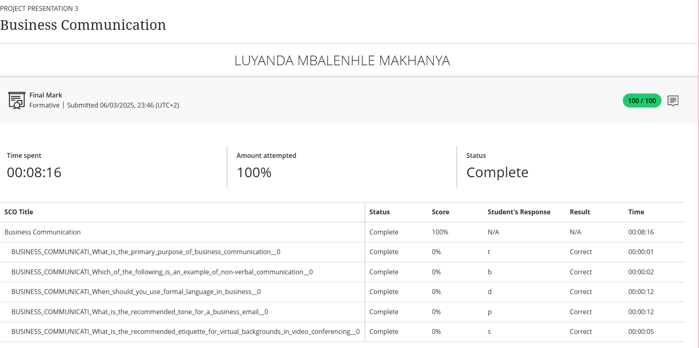
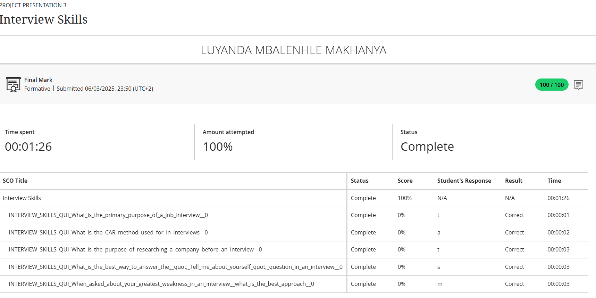

# 💼 Luyanda's Professional Digital Portfolio

## 👤 About Me  
Hello! My name is **Luyanda**, a **Diploma in ICT: Application Development** student at CPUT.  
This portfolio showcases my skills, experiences, and reflections based on work readiness training.

---

## 🎯 Career Counselling

### 🪞 Reflection: Career Counselling (STAR Technique)

**S – Situation**  
As part of my work readiness training, I was required to complete a Career Development quiz that assessed my understanding of topics such as goal setting, career planning, and identifying hard and soft skills.

**T – Task**  
My objective was to test my knowledge and application of the career counselling material and demonstrate my readiness to make informed career decisions.

**A – Action**  
I completed the quiz independently and carefully considered each question, applying concepts I had learned through the career counselling process.

**R – Result**  
I achieved a **100/100 score**, which reflects my strong grasp of the subject matter and my active engagement with the career development process.

---

## 🧠 Skills and Interests

### 🪞 Reflection: Skills & Interests (STAR Technique)

**S – Situation**  
As part of my personal development training, I completed a quiz focused on understanding my core skills, interests, and values that influence career choices.

**T – Task**  
The goal was to assess how well I could identify transferable skills, differentiate between interests and values, and understand their impact on career paths.

**A – Action**  
I reviewed my study materials, reflected on my past experiences, and answered each question thoughtfully. I drew from both academic knowledge and personal self-awareness.

**R – Result**  
I achieved a **100/100 score**, successfully identifying key concepts and their relevance to career development. This reflection helped me recognize my strengths and how they align with roles in technology and development.

---

## 📄 Create a CV

 

### 🪞 Reflection: CV Creation (STAR Technique)

**S – Situation**  
While preparing for internship and job applications in the ICT field, I needed a professional CV that reflected both my technical skills and career readiness.

**T – Task**  
I needed to:  
1. Understand industry standards for ICT CVs  
2. Highlight my technical skills effectively  
3. Optimize the document for Applicant Tracking Systems (ATS)

**A – Action**  
1. **Completed the CV Quiz** (scored 100%) to learn CV fundamentals:  
   - Learned to list work experience in *reverse chronological order*  
   - Understood how to categorize skills (e.g., *"Python (Intermediate)"*)  

2. **Iterative Improvements**:  
   - Created 3 CV drafts and incorporated feedback from:  
     - CPUT Career Services  
     - ICT professionals on LinkedIn  
   - Used [ResumeWorded.com](https://resumeworded.com) to improve ATS compatibility  

3. **Tailored Content**:  
   - Added key projects with GitHub links  
   - Included certifications relevant to the roles I’m targeting  

**R – Result**  
I now have a well-structured and ATS-friendly CV that confidently presents my qualifications. It reflects both my technical background and commitment to continuous improvement, and I’ve already used it to apply for several industry-relevant opportunities.

---

## 📬 CV Submission

[📄 View My CV (PDF)](CV.pdf)

### 🪞 Reflection: CV Submission (STAR Technique)

**S – Situation**  
As I prepared for job opportunities and internships, I realized I needed a professional CV that clearly highlighted my skills, education, and experiences in ICT and application development.

**T – Task**  
My goal was to create a clean, well-structured CV that reflects my qualifications, projects, and soft skills in a way that would appeal to employers in the tech industry.

**A – Action**  
I selected a professional template, gathered all relevant information, and focused on tailoring the content to reflect my technical competencies (e.g. Java, SQL, APIs) and teamwork experiences. I also ensured that the formatting was consistent and easy to read.

**R – Result**  
The result is a polished CV that I can confidently submit for job applications. It presents me as a focused and capable candidate, and I’ve already used it to apply for internships through platforms like LinkedIn and job portals.

## 📬 Business Communication

**Reflection**

**S**- During my Business Communication formative assessment, I was required to demonstrate my understanding of effective workplace communication principles, including professionalism, tone, and etiquette

**T**-My goal was to apply the knowledge gained from the Business Communication module to complete the assessment accurately and show mastery of both verbal and non-verbal communication techniques.

**A**- I reviewed all the module content, focusing on communication tone, formality, and email etiquette. I ensured that my answers reflected real-world business standards, such as using appropriate tone and clarity in messaging. I also practiced responding to different communication scenarios before taking the assessments

**R**- I successfully completed the assessment with a 100% score, proving my ability to apply business communication principles effectively. This achievement shows that I can communicate clearly, professionally, and appropriately in workplace environments.

##  Interview Skills

## Reflection

**Situation**
As part of the Project Presentation 3 coursework, I was required to complete an online quiz on Blackboard to test my foundational knowledge of effective interview skills. The quiz consisted of multiple-choice questions covering key topics such as the purpose of an interview, structured response methods like CAR, and strategies for answering common interview questions.

**Task**
My task was to successfully complete this quiz, demonstrating a clear understanding of core interview concepts. The goal was not just to achieve a high score, but to internalize these techniques so I could apply them confidently in a real-world job interview scenario.

**Action**
Before attempting the quiz, I reviewed the provided learning materials on interview preparation. During the quiz, I carefully read each question and selected the answer I believed was most correct based on my study. For example:
I understood that the primary purpose of an interview is a two-way conversation to assess mutual fit, not just a one-sided interrogation.
I recognized the CAR method (Context, Action, Result) as a structured technique for answering behavioral questions.
I selected the strategy of providing a concise, professional summary when asked "Tell me about yourself," rather than a personal history.
The screenshot shows I completed the quiz with a 100% completion status, indicating I engaged with all the questions.

**Result**
I successfully completed the quiz, answering all questions correctly as indicated by the "Correct" result for each one. More importantly, this exercise solidified my theoretical knowledge of interview fundamentals. I now feel equipped to apply these concepts practically; specifically, I plan to use the CAR method (and its more common counterpart, STAR) to structure my answers, ensuring I provide concrete examples of my skills and experiences. This quiz was a valuable step in building my confidence for upcoming mock interviews and real job applications.

## Mock Interview Video
[
**Evidence**
**Situation:**
As part of developing my professional interview skills, I participated in a recorded mock interview session. The interview simulated a real-world scenario for an entry-level position in the ICT field, featuring common behavioral and technical questions that graduates typically encounter.

**Task:**
My objective was to demonstrate strong communication skills, professional demeanor, and the ability to effectively articulate my qualifications using structured response methods. I aimed to practice handling pressure, thinking on my feet, and receiving constructive feedback to identify areas for improvement.

**Action**
For the "Tell me about yourself" question, I prepared and delivered a structured elevator pitch that covered:
Present: My current status as a final-year ICT Diploma student at CPUT
Past: Relevant technical skills and project experience gained during my studies
Future: My career aspirations and how they align with potential roles in the technology sector
Throughout the mock interview, I consciously applied the STAR technique to behavioral questions, ensuring my answers were specific and results-oriented. I maintained professional body language, active listening, and thoughtful pacing in my responses

**Results**
The mock interview was an invaluable learning experience. Reviewing the recording allowed me to objectively assess my performance. I received positive feedback on my structured approach to "Tell me about yourself" and my ability to provide concrete examples of my skills. Areas identified for improvement included reducing nervous habits and elaborating more on specific technical projects. This exercise significantly boosted my confidence and provided tangible evidence of my interview readiness.

## Professional Interview

